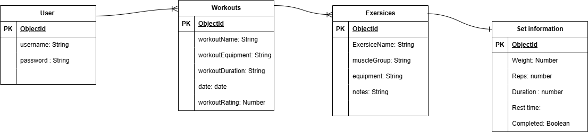

# TrackLift 🥇

## Overview
TrackLift is a fitness tracking and community platform designed to help users record their daily workouts, monitor their fitness progress, and stay motivated throughout their fitness journey. By combining powerful workout logging tools with social features, TrackLift creates an engaging environment where users can achieve their goals while connecting with others who share similar interests.

The application allows users to log every workout by recording exercises, sets, reps, weights, workout duration, and personal notes. Users can easily review their workout history, track performance improvements, and monitor personal records over time. Progress analytics help users identify trends, maintain consistency, and make informed decisions about their training
## Screenshots

## Technologies Used
HTML - CSS - Java Script - Node - Express - MongoDB
## Getting Started

## Installation

## User Stories
- As a new user, I want to create an account so that I can save my workouts and track my progress.
- As a registered user, I want to log in securely so that I can access my personal data.
- As a user, I want to edit my profile so that I can keep my personal information up to date.
- As a user, I want to log out securely so that my account remains protected.
- As a user, I want to create a workout log so that I can record my daily training sessions.
- As a user, I want to add multiple exercises to a workout so that I can track my complete routine.
- As a user, I want to record sets, reps, weights, and rest time for each exercise so that I can monitor my performance.
- As a user, I want to share my completed workouts so that I can inspire others.
- As a user, I want to view a community feed so that I can discover workouts and stay motivated.
- As a user, I want to edit or delete workout logs so that I can correct mistakes or remove unwanted entries.
## Database Design

## Routes

| Method | Route | Description |
|---------|-------|-------------|
| GET | / | Home page |
| GET | /listings | List all listings |
| GET | /listings/new | New listing form |
| POST | /listings | Create listing |
| GET | /listings/:id | View listing |
| GET | /listings/:id/edit | Edit listing form |
| PUT | /listings/:id | Update listing |
| DELETE | /listings/:id | Delete listing |

## Features

## Future Enhancements

## Credits